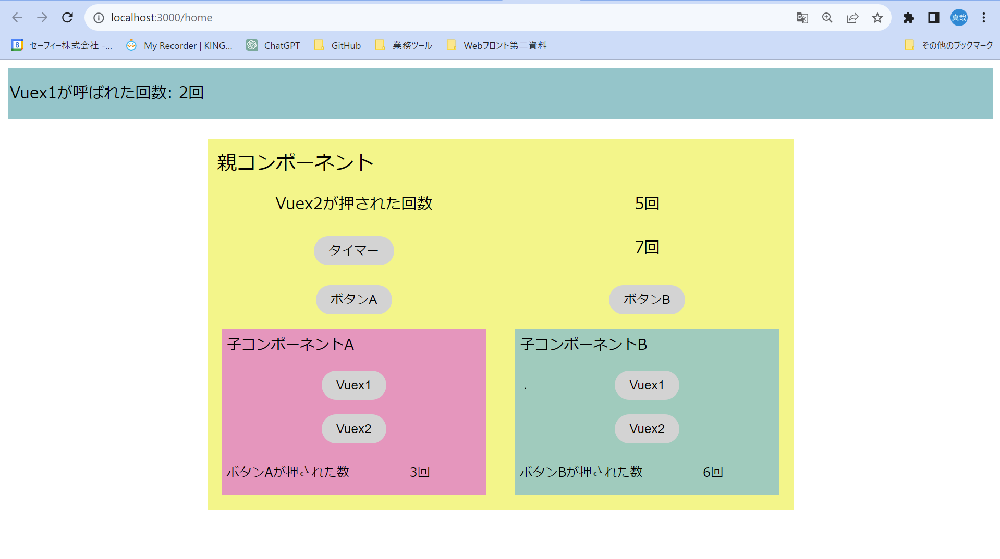

# NuxtでのTutorial

## 完成したもの



## ファイル構成

```text
src
  ├─components
  │  ├─app
  │  │   └─ Header.vue
  │  │   └─ Timer.vue
  │  ├─common
  │  │    └─AlignTwoObject.vue
  │  ├─pages
  │  │  └─home
  │  │      └─Parent.vue
  │  │      └─Parent
  │  │          └─Child.vue
  │  └─ui-library
  │        └─CustomButton.vue
  │
  ├─layouts
  │    └─ default.vue
  │
  ├─pages
  │   └─home.vue
  │
  ├─store
  │  └─app
  │     └─ actions.ts
  │     └─ getters.ts
  │     └─ mutations.ts
  │     └─ state.ts
  │
  └─types
      └─store
          └─app
             └─ AppState.ts
```
